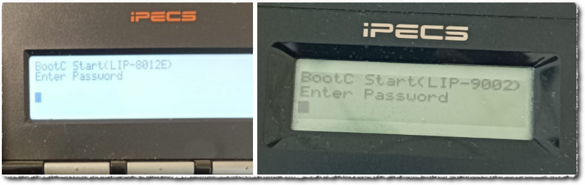
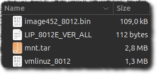

# TLDR
Özet olarak; cihazın işletim sisteminin TFTP üzerinden yeniden yüklenmesi gerekiyor. Bu işlem, telefon setinin firmware güncellemesinden farklı. Orada kullanılan dosyalar burada işe yaramıyor. Recovery yüklemesi için ayrı dosyaları var.


İşi yaparken baz aldığım kaynak: [http://forum.artcom.ru/lofiversion/index.php/t12655.html](http://forum.artcom.ru/lofiversion/index.php/t12655.html)

# Gerekli dosyalar
Github üzerinde paylaştım ilgili dosyaları: [https://github.com/ozalpmurat/IPECS/](https://github.com/ozalpmurat/IPECS/)

# İşlem basamakları ve bazı önemli noktalar
- Telefonun parola istediği ekranda 1234 yazıp `Ok` tuşuna bas.
- IP adresi isteyecek. Set için bir IP adresi ver.
- Alt ağ maskesi ver.
- Sunucu IP'si istediği yerde TFTP Server'ın adresini ver.
- TFTP server'ın çalıştığı bilgisayarda (kendi bilgisayarım) tcpdump ile dinleyince `LIP_8000E_VER_ALL` isimli bir dosya istediğini gördüm. Bu metni Google'layınca yukarıda verdiğim link geldi. Orada birileri işletim sistemini de paylaşmış. Onu indirip sete yükledim ve düzeldi. Dosya isminden anlaşılacağı üzere, setin modeline göre aradığı özel bir dosya ismi bu.
- Set ekranında aşamalar takip edilebiliyor. Birkaç kere yeniden başlayıp TFTP server'dan bir şeyler indiriyor. Sonra normal açılıyor.
- Setin TFTP server'da aradığı `LIP_8000E_VER_ALL` dosyası metin biçiminde bir dosya. İçerisinde sete yüklenecek olan diğer dosyaların isimleri yazıyor.
- Dosyayı 8012 modele göre düzenleyip TFTP klasörüne koyunca set hemen indirmeye başladı.
- `LIP_8000E_VER_ALL` içerisindeki dosya isimlerinin yanında bir de hash (sanırım) var. Hash kısmını değiştiremedim çünkü hash'in algoritmasını bulamadım. 8 bayt'lık çıktı veren standart bir hash algoritması yok çünkü. Çok bilinen bazı algoritmaların ilk ve son 8 baytlarını karşılaştırdım ama tutmadı. Aşağıda bahse konu dosyanın içeriği var:

**LIP_8000E_VER_ALL içeriği:**
```
version LIP_8012-10Bq
btr_img image452_8012.bin 008f359e
ker_img vmlinuz_8012 0a7867f8
tar_img mnt.tar 1237718a
```

**Not:**
> Not: LIP_8000E_VER_ALL dosyası ile birlikte toplamda 4 tane dosya olması lazım TFTP klasöründe.
