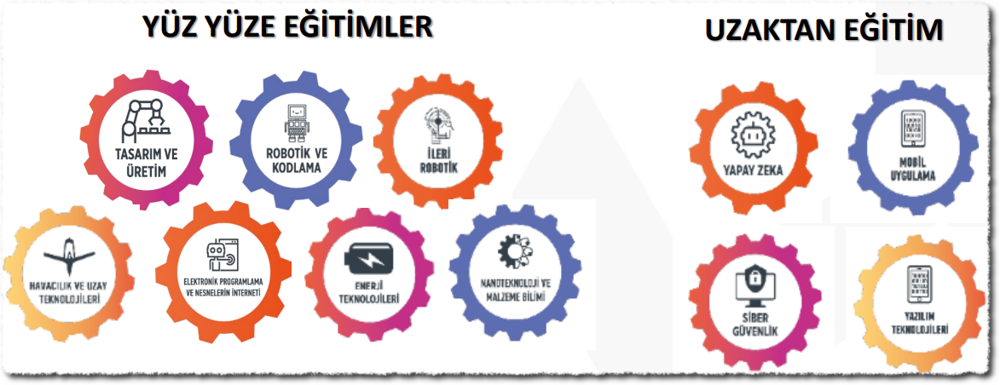

# Özet
Deneyap; Sanayi ve Teknoloji Bakanlığı, Gençlik ve Spor Bakanlığı, TÜBİTAK ve Türkiye Teknoloji Takımı (T3) Vakfı işbirliği ile kurulan bir eğitim programıdır. Burada bir süredir eğitmenlik yapıyorum ve tecrübelerimi paylaşmak istedim.

Deneyap hakkında sıkça sorulan sorular (SSS) için kendi web sitesine bakabilirsiniz. Ben orada olmayanları yazmaya çalıştım. İlgili SSS sayfası: [https://www.deneyap.org/tr/hakkimizda/sss/](https://www.deneyap.org/tr/hakkimizda/sss/)

# Yetkili ve sorumlular kimdir?
Eğitmen alımları, öğrenci alımları gibi organizasyonel konular T3 tarafından yürütülmektedir. Ücretlerin ödenmesi gibi bazı konular ise TÜBİTAK tarafından yapılmaktadır. İçeriklerin hazırlanması için, akademisyenlerden oluşan bir eğitmen komisyonu bulunmaktadır. Her ilde bir Deneyap sorumlusu görevli bulunur.

# İçerikler nedir?
Derslerin listesi ve içerikleri zaten internet üzerinde var. PDF biçiminde şuradan görebilirsiniz: [https://yayinlar.tubitak.gov.tr/deneyap-atolyesi](https://yayinlar.tubitak.gov.tr/deneyap-atolyesi)

# Dersler nasıl işleniyor?
Bazıları yüzyüze, bazıları online ders şeklinde. İlk ders "tasarım ve üretim". Bu derste; cnc freze, lazer kesim, küçük torna makinesi ve kıl testere gibi aletler ile tahta şekillendirme ve tasarım işleri yapılıyor. Bundan sonra robotik dersinde basit Arduino uygulamaları var. Böyle yavaş yavaş ilerliyor dersler. Tüm ders listesini Deneyap web sitesinde görebilirsiniz.

# Bilişim konusundaki uygulama içerikleri
- [Blok kodlama](https://blok.deneyapkart.org/)
- C ve C++ dili ile programlama
- Arduino IDE'si üzerinde Deneyap kart programlama
- Siber güvenlik'te VirtualBox üzerinde Kali Linux uygulamaları. Bunların tamamını video çekerek paylaştım: [https://www.youtube.com/@muratozalp](https://www.youtube.com/playlist?list=PLaH-z-61ZElkyJFP4oH7am40tKhEnanEE)
- Python ile yapay zeka uygulamaları (Anahtar sözcükler: Anaconda, Spyder, Iris, scikit-learn, pandas, numpy, matplotlib, tensorflow). Bu konuda da Anaconda yerine Thonny kullanılması konusunda ısrarlı bir video çektim: [https://www.youtube.com/watch?v=JQWTyzPo_hg](https://www.youtube.com/watch?v=JQWTyzPo_hg)
- Mobil programlama (içeriğe bakmadım)

# Ne kadar zaman ayırmak lazım?
2024 yılında yapılan bir değişiklik ile biraz daha sabit/kalıcı eğitmen alma yoluna gittiler. Hafta sonu 2 gün toplam 12 saatlik eğitim verilecek. Hafta içi de duruma göre 4 saatlik eğitim veya toplantılar olabilecek. 2024 öncesinde sadece eğitmen olarak sadece 1 ders (haftada 4 saat) bile alınabiliyordu.

# Ücret nasıl?
Hafta sonu 12 saat, hafta içi de 4 saat olarak planlanan bir ders programı sonrasında asgari ücretin az üstü olacağı tahmin ediliyor. 2024 bahar ayları için, 1 saat ders ücretinin $6 civarında olduğunu söyleyebilirim :)
Ödemeler aylık olarak TÜBİTAK tarafından IBAN'a göndeirliyor. Ayın 25'i civarlarında yatıyor.

# Eğitimler zor mu?
Değil. Konuya az hakimiyeti olan birileri bir ay öncesinden kitap üzerinden çalışırsa yeterli olur. Konu ile yakından ilgili kişiler her ders öncesinde birkaç saatlik çalışma yaparsa yeterli olur. 

# Neye çalışılacak?
- Siber güvenlik gibi hızlı değişen konularda derslerden önce mutlaka uygulamalar test edilmeli
- Robotik gibi derslerde uygulamalar önceden denenmeli, çıkabilecek konularda tecrübe sahibi olunmalı
- Online derslerde sunu hazırlama gibi işler olabiliyor. Ancak Telegram grupları üzerinde bu konuda içerik paylaşımı yapılıyor.
- Yine özellikle online derslerde her hafta için bir Kahoot sınav uygulaması yapılırsa motivasyona müthiş katkısı oluyor. Sırf Kahoot için 4 saat derse katlanan öğrenciler gördüm :)

# Özel durumlarım/sorularım var
Online başvuruyu yaptıktan sonra, zamanı geldiğinde il sorumlusu ile mülakata çağrılacaksınız. Özel durumlarınızı, şartlarınızı ve sorularınızı orada konuşabilirsiniz. Online başvuruyu yapmak kesin kayıt anlamına gelmiyor.