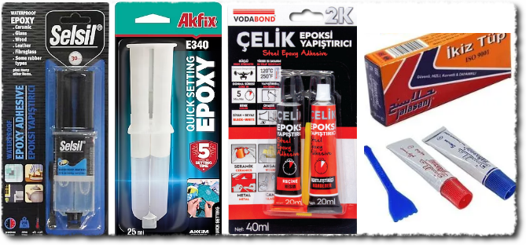
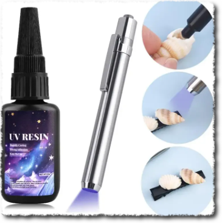
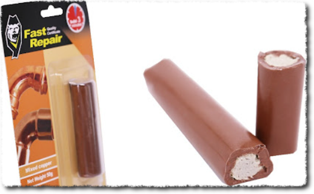
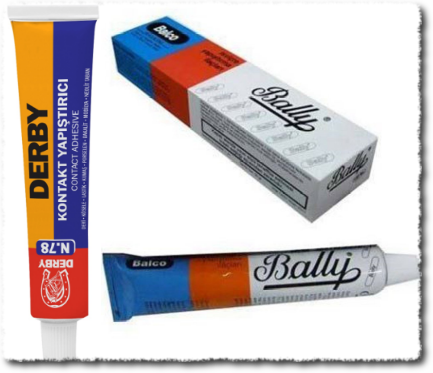
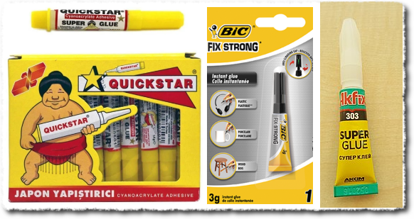
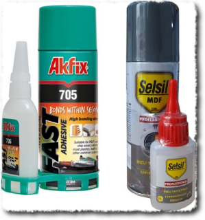
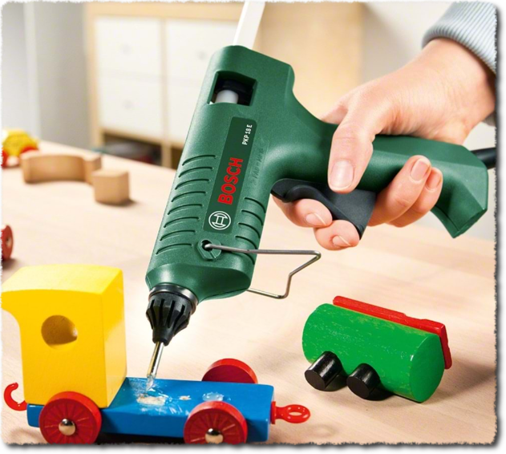
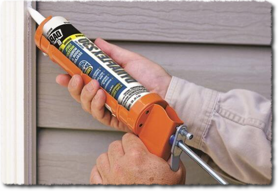

Evde küçük tamir işleri hobi oldu biraz bende. Farklı farklı işlerde farklı yapıştırıcılar kullanınca paylaşmak istedim bunları.

**İÇİNDEKİLER:**
* Do not remove this line (it will not be displayed)
{:toc}

# Tutkallar
## Epoksi tutkallar
### 2 bileşenli epoksi tutkal
_İran yapıştırıcısı_ veya _metal yapıştırıcısı_ olarak ta bilinebiliyor. Farklı markaların şeffaf veya renkli ürünleri var. Reçine ve hızlandırıcı amaçlı 2 farklı ürün aynı miktarda karıştırılıp kullanılıyor. Tamamen  kürleşmesi 24 saati buluyor. Farklı amaçlarla kullanılabilir. Isıya dayanıklıdır. Zımpara ve delme işlemleri yapılabilir. Tencerenin kırılan porselen sapını yapıştırdım, yıllardır sağlam. Brita sürahinin çatlayan üst kısımlarını yapıştırdım, o da beklemediğim kadar sağlam oldu. Klozet rezervuar parçaları gibi su içinde kalan işlemlerde de sorunsuz kullandım. Tamamen kürleştikten sonra esnemesi sıfıra yakın, özellikle şeffaf olanları cam gibi oluyor. Hareketli parçaların yapıştırılmasında sıkıntı olabilir.

### UV ışıkla sertleşen epoksi tutkal
Morötesi (UV) ışıkla kürleşiyor. Hızlandırıcı gerekmediği için, tek bileşenli. UV ışık ile 1-2 dakika içinde tamamen kürleşebiliyor. Genelde şeffaf oluyor. Üstteki kadar güçlü değil gibi geldi bana. Ama çok yük taşımayacak yerlerde tercih edilebilir. En önemli avantajı; çalışma süresi uzun ve istendiğinde hızlı bir şekilde kürleşebiliyor olması. Genellikle takı işlerinde tercih ediliyor sanırım. Uzun süreli bri yapıştırıcının kürleşmesini beklerken, geçici olarak idare etmesi için bunu kullandığım oldu.  

### Epoksi macun
İki bileşenli ve adından anlaşılacağı gibi macun kıvamında oluyor. İkisinden de aynı miktarda alıp karıştırıp kullanılıyor. Dolgu ağırlıklı kullanım alanı var. Bir parçanın delinen veya kopan kısmının yerine bunu kullanabilirsiniz mesela. Kuruduktan sonra taş gibi sert oluyor. Klozet rezervuarı içindeki şamandıranın kırılan plastik kısımlarını birkaç kere bununla tamir ettim. Aynı yerden bir daha arıza olmadı. Köyde eternit çatı malzemesinin deliklerini de tıkadım bununla. Eğer havasız ortamda muhafaza edebilirseniz, yıllarca kullanabilirsiniz. Ben şimdiye kadar 2 kere aldım bu macundan, plastik tüp içinde satılanlardan. 10 yıl boyunca azar azar böyle işlerimde kullandım. Farklı markaları da var. Macunlar görseldeki gibi sarılı olarak veya tamamen 2 ayrı parça olarak satılan türler de var.  

## Kontakt yapıştırıcı (solventli)
Yapıştırıcı/tutkal deyince eskilerin ilk aklına gelenlerden birisi bu yapıştırıcılar. Isıya dayanıklı olduğunu zannetmiyorum ama bunun haricinde dış ortam koşullarına dayanıklı zannediyorum. Ayakkabı tamircileri hep bunu kullandığı için böyle düşündüm :)
Kullanımı biraz garip. İki bileşene sürdükten sonra 15-20 dakika bekliyoruz, sonra presleme veya tokmaklama ile sıkıştırıyoruz. 1-2 saat sonra tamamen kullanılabilir oluyor. Şeffaf değil, görünür yerlerde dikkatli kullanılmalı. Deri, kağıt, kumaş, tahta gibi bilimum yapıştırma işlerinde kullanılabilir.  

## Japon yapıştırıcısı (super glue)
Teknik ismi siyanoakrilat (cyanoacrylate) olan bu yapıştırıcı, ele göze gelirse, deriyi sökerek ayrılabiliyor. Yoğunluğu (viskozite) düşük olduğu için (neredeyse su gibi) çatlaklara güzel nüfuz etme özelliği var. İstenirse hızlandırıcı sprey ile de kullanılabilir. Kuruduktan sonra sertleşir. Ancak damlacık şeklinde durduğu sürece kürleşmiyor. Bu nedenle az kullanmak lazım. Çok yük taşımayacak olan oyuncak parçaları gibi yapıştırma işlerinde kullanılabilir.
Karbonat, sigara külü, kurşun kalem ucu grafit tozu gibi malzemelerle harmanlayıp hem dolgu hem de yapıştırma anlamında çok güzel işler yapanlar var; Youtube'da bulabilirsiniz.  

##  İki bileşenli hızlı yapıştırıcı
(MDF Kit diyenler de var).  
Yukarıdakinin biraz daha koyu kıvamlı (yoğun viskoziteli) olanı. Yanında hızlandırıcı ile geliyor. Hızlandırıcı reaksiyonunda ısı veriyor. Kimyasal yanıklara dikkat. Bunu bir ustanın geçici tutkal amacı ile kullandığını gördüm. Ahşap malzemeleri yapıştırırken asıl ahşap tutkalının kuruması uzun sürdüğü için birkaç noktadan da bu yapıştırıcı ile destekledi. Böylece ahşap tutkalını beklerken işkence kullanmaya gerek kalmadı.  

## PVA slime tutkalı
PVA (Polivinil asetat) tutkalı, çocukların slime yapmak için kullandığı beyaz/şeffaf renkli su bazlı tutkaldır. Ahşap, kağıt, karton gibi gözenekli yüzeylerde oldukça etkilidir. Suya dayanıklı değildir. Kuruduktan sonra şeffaf bir görünüm alır. Çocuk oyuncakları ve el işi projelerinde sıkça kullanılır.

## Silikon tutkallar

### Sıcak silikon
Sıcak silikon tabancası ile kullanılan çubuk şeklindeki yapıştırıcıdır. Tabanca ısıtıldığında eriyerek akışkan hale gelir ve soğudukça katılaşır. Hızlı kuruması ve çeşitli malzemelere yapışabilmesi nedeniyle el işi projelerinde, dekoratif uygulamalarda ve geçici yapıştırma işlemlerinde sıkça tercih edilir. Dış mekan şartlarına pek uygun değildir. Ayrıca yüksek sıcaklıklarda yumuşayabilir veya eriyebilir.

Standart olarak 2 farklı kalınlıkta ve farklı renklerde silikon çubuklar bulunabilir. Kuruduktan sonra mukavemeti fazla değildir. 

Bence her evde olması gereken bir yapıştırıcıdır. Maddi açıdan sıkıntı yoksa, görseldeki Bosch'un ürününü tavsiye ederim. Dremel ürünleri de iyidir. 8-10 tane farklı marka eskittikten sonra görseldekini aldım ve eskitemedim.

### Soğuk yapı silikonları (tüp veya tabanca tipi)
Çoook fazla türü var bunun. Genellikle tüpte satılırlar, özel tabancası ile sıkılırak kullanılırlar. Yapışkanlık gücü genellikle çok iyidir. Suya ve sıcağa dayanıklı, esneme kabiliyeti olan, şeffaf renk olanları vardır. Duşakabinlerin kıyısında hem yapıştırma hem de su sızdırmazlığı için kullanılır. Küçük işler için diş macunu gibi küçük tüpte satılanları da vardır.

Eğer dolgu amacıyla kullanılacak ve üzerine de boya yapılması ihtimali varsa, _mastik_ denilen türde olanlar tercih edilebilir.  

### Soğuk kırtasiye silikonu

## Diğer tutkallar
Mum tutkal, Uhu gibi olanlar, tack-it tarzındakiler, vb.

## Ahşap tutkalları
xxx

# Bantlar
xxx

## Duck tape
xxx

## Bez bant
xxx

## Çamur bant
xxx

## Gerdir-sar bant
xxx

## İzole bant (elektrik bandı)

## Diğer
Koli bantı, para bandı, çift taraflı bant, vb.

# Diğer malzemeler
xxx

## Plastik birleştirme kaynak telleri
xxx

## Düşük sıcaklık kaynak malzemesi
xxx

##
Lehim
xxx

## "Unutulmasın" Listesi
- Kimyasal dübel
- İzole bant
- Silikon/Mastik
- Epoksi macun ve tutkal
- Tamir bandı
- Çamur bant
- Bakır bant
- Soba bandı
- Bez bant
- Makaron
- Plastik sıcak zımba kaynağı
- Japon. Cıvık ve jel olan
- Pva
- Silikon tutkal
- Ahşap tutkalı. D1,2,3 marin, iskelet
- PU köpük
- Maskeleme bandı
- Çift taraflı bantlar
- Duvara bir şey takma yapıştırıcıları
- Kontak yapıştırıcı
- Sıcak silikon
- Uhu
- Stick yapıştırıcı
- Koli bandı
- Teflon bant
- Pencere soğuk koruma bandı
- Sıvı conta
- E-6000 ve kardeşleri