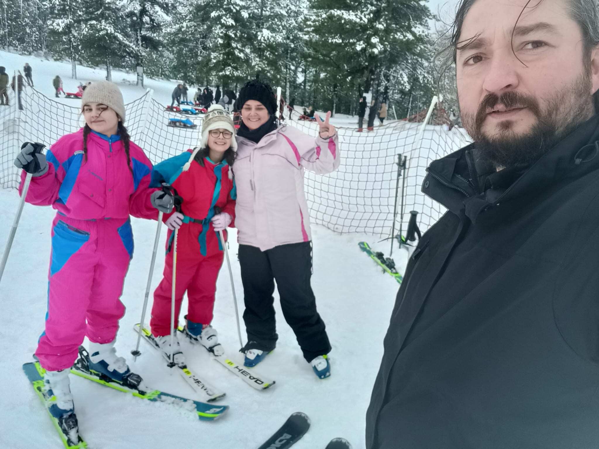
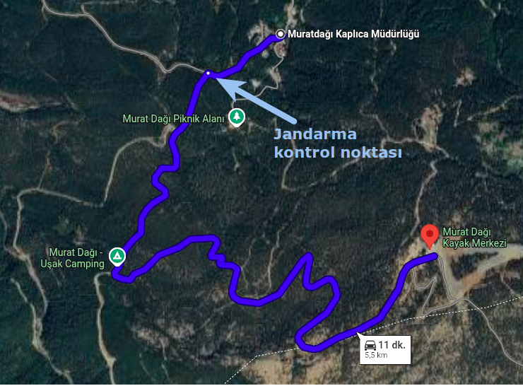

> Not: Bu ikinci kayak deneyimimz. İlkini okumak isterseniz, buraya tıklayabilirsiniz: [İlk Kayak Tecrübesi (Sisli Vadi)](https://ozalpmurat.github.io/posts/ilk-kayak-tecr%C3%BCbesi-Sislivadi/)

Murat Dağı Kayak Merkezi, özellikle ilk kez kayak ya da snowboard deneyecekler için temel ihtiyaçları karşılayan, küçük ama işlevsel bir tesis izlenimi veriyor. Tesisin ücretlendirmesi, pist durumu ve yol koşulları gibi önemli detayları bizzat yaşayarak not aldık.

### Ücretler (2026 Ocak sonu)

Tesis içindeki kiralama ve yeme-içme fiyatları Ocak 2026 sonu itibarıyla kabaca şu şekildeydi: Kayak takımı (kayak, bot, baton) **₺1000** iken, snowboard kiralama **₺1200** civarındaydı. Pantolon kiralamak **₺200** tutarken, kızak kiralama (saatlik) ve tost gibi atıştırmalıklar da aynı fiyata (**₺200**) bulunuyordu. Dolap kirası yalnızca **₺50** iken, bir çay **₺20** idi. Biz konaklamadık fakat bir oda fiyatının **₺3200** olduğunu öğrendik. Ekipman konusunda, pantolon stoğu az ve ıslak kalmış olabileceği için \"erken gelen alır\" durumu söz konusu. Kask ve gözlük mevcut olduğu söylendi, ancak biz bunları kullanmadık.

### Pistler ve Kayak Alanı: Yeni Başlayanlar İçin İdeal

Üst tesiste birkaç pist olmasına rağmen, gittiğimiz gün **yürüyen bant ile çıkılan pist** aktifti. Bu pistin uzunluğu **215 metre** ve dikey irtifa farkı **30 metre** idi. T-bar ile çıkılan daha dik eğimli pistler ise kapalıydı; muhtemelen bu durum yeni başlayanların güvenliği için düşünülmüş. İyi haber şu ki, **yürüyen bant** ve **kızak pisti tamamen ücretsiz**! Kızakçılar, kayakçılardan ayrı bir pistte, yukarı yürüyerek çıkıyorlar.

### Kritik Bilgi: Yol Durumu ve Jandarma Kontrolü

Yol durumu, Murat Dağı deneyiminin en kritik kısmı. Bizim günümüzde yolun **10.30'da açılacağı** söylenmesine rağmen, açılış ancak **11.20 civarında** gerçekleşti ve kısa süre sonra tekrar kapandı. Biz sıradayken kapanma yaşandığı için, muhtemelen yolda kalan binek araçlar nedeniyle yaklaşık **15–20 dakika** daha bekledik. Yol açıldığında ise öncelik **4x4, kış lastiği ve zinciri olan araçlara** verildi. Jandarma, hava şartları çok kötüyse ya hiçbir araca izin vermiyor ya da yalnızca kış lastiği ve zinciri olanlara geçiş izni veriyor. Eğer araç geçişine izin verilmezse, **alt tesisten üst tesise sürekli servis** hizmeti sağlanıyor.

### Rakım Farkı ve Operasyon Saatleri

Tesisler arasında ciddi bir rakım farkı var: **Alt tesis 1450 m**, **Üst tesis ise 1850 m**. Bu iki nokta arasında resmen **bir mevsim farkı** yaşanıyor; aşağıda sonbahar atmosferi varken, yukarıda tam kış şartları hakimdi. Bu yüzden gitmeden önce üst rakım için mutlaka hava durumuna bakılmalı. Yürüyen bandın kapanış saati normalde **16.00–17.00 arası** olarak belirtilmiş olsa da, bizim günümüzde bant **16.50 civarında kapandı**; kapanış saatine **jandarma karar veriyor**. Üst tesiste **konaklama imkanı yok** ve saat **17.30'dan sonra jandarma tesisi tamamen boşaltıyor**. Alt tesiste konaklama ve termal tesis imkanı bulunuyor (biz gezmedik). Yollar hakkında bilgi: Alt tesis yolu sürekli açık; **Gediz tarafı** yolu güzelken, **Altıntaş tarafı** daha virajlı. Unutmayın, alt ve üst tesis arasındaki yol kar yağışı sebebiyle **akşamları kapanıyor** ve her sabah tekrar açılıyor.

### Eğitim ve Güvenlik

Kayak eğitimi **ücretsiz** olarak sunuluyor: Yaklaşık **20 dakika** temel anlatım ardından **1 saat** serbest çalışma yapılıyor. Özel eğitim olmasa da hocalar sahada bulunup yardımcı oluyor. Güvenlik konusunda jandarma sürekli sahada ve kar motosikletleriyle devriye atıyor. Hatta bir snowboardcunun rampada düşmesi üzerine sedyeyle hızlıca müdahale ettiklerini gözlemledik. Tesis içinde giyinme odaları ve mescit gibi olanaklar da mevcut.

### Genel Değerlendirme

Murat Dağı Kayak Merkezi, büyük kayak merkezleriyle kıyaslanamaz olsa da; **ilk kez kayak yapacaklar**, **çocuklarla gelenler**, sadece **\"bir günlüğüne kar görelim\"** diyenler ve **uygun fiyatlı** bir gün geçirmek isteyenler için yeterli ve tatmin edici. En önemli tavsiyelerimiz: Hava, yol ve ekipman durumunu gitmeden önce mutlaka kontrol edin. Jandarma kontrolü sıkı olsa da bu durum güven verici.